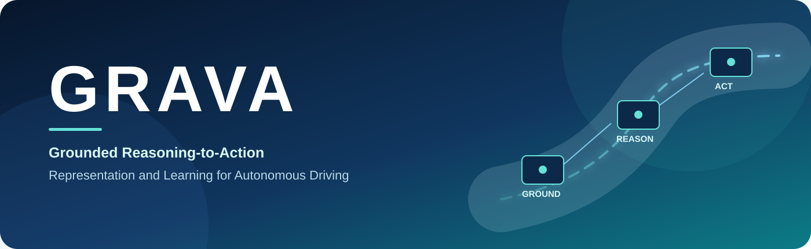
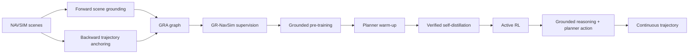

  

<h1 align="center">GRAVA</h1>

  <strong>Grounded Reasoning-to-Action Representation and Learning for Autonomous Driving</strong>

  Xiao Liu · Haoyu Li · Lin Wang · Chao Sun

  
  
  
  

  <a href="#overview">Overview</a> ·
  <a href="#highlights">Highlights</a> ·
  <a href="#method">Method</a> ·
  <a href="#project-ecosystem">Ecosystem</a> ·
  <a href="#release-roadmap">Roadmap</a> ·
  <a href="#citation">Citation</a>

## Overview

GRAVA is a vision-language-action framework that keeps physical scene evidence
connected to reasoning and executable driving behavior. Its **Grounded
Reasoning-to-Action (GRA)** representation binds linguistic references to visual
regions and ego-centric physical states, organizes object interactions and
driving decisions in a trajectory-anchored graph, and serializes the resulting
reasoning together with a compact planner action in one autoregressive stream.

The project covers the full research workflow: grounded data construction,
GR-NavSim, progressive model training, executable trajectory generation, and
NAVSIM evaluation.

## Highlights

- **Grounded reasoning that reaches the action.** Visual references and physical
  quantities remain attached to the interactions and decisions used for planning.
- **One autoregressive reasoning-to-action interface.** A single VLM generates
  grounded reasoning followed by an Executable Planner action, which is decoded
  deterministically into a continuous trajectory.
- **GRA-aligned data and learning.** Forward scene grounding and backward
  trajectory anchoring produce consistent cognition and planning supervision;
  progressive training combines grounded pre-training, planner warm-up, verified
  self-distillation, and Active RL.

| 107K | 2.2M | 70K | 90.48 |
| :---: | :---: | :---: | :---: |
| grounded scenes | grounded QA pairs | GRA reasoning traces | NAVSIM PDMS |

The NAVSIM result uses one front camera and one greedy autoregressive completion
per scene under the official full protocol. Release artifacts and reproduction
details are being prepared.

## Method

At inference time, GRAVA receives visual observations and navigation context. It
produces grounded reasoning and a primitive-specific planner action in a shared
sequence; a fixed geometric decoder then recovers the trajectory.

## Project ecosystem

| Repository | Purpose | Status |
| --- | --- | --- |
| **[grava](https://github.com/AhernResearch/grava)** | Project overview and release hub | Available |
| [grava-agent](https://github.com/AhernResearch/grava-agent) | Offline GRA annotation and data construction | Preparing release |
| [gr-navsim](https://github.com/AhernResearch/gr-navsim) | Dataset documentation and release assets | Preparing release |
| [grava-train](https://github.com/AhernResearch/grava-train) | Multi-stage training and evaluation | Preparing release |
| [grava-common](https://github.com/AhernResearch/grava-common) | Shared data contracts and geometry utilities | Under review |
| [grava-sim-engine](https://github.com/AhernResearch/grava-sim-engine) | NAVSIM trajectory scoring integration | Under review |

## Release roadmap

- [x] Project homepage and repository map
- [ ] Paper preprint and BibTeX
- [ ] GR-NavSim data card, versions, and download instructions
- [ ] Annotation and data-construction code
- [ ] Training and evaluation code
- [ ] Model checkpoints and end-to-end reproduction guide

We are releasing the project in stages so that every public artifact has a clear
version, documented inputs and outputs, and a reproducible validation path.

## Citation

The paper citation will be added when the preprint is available.

## Acknowledgements

GRAVA builds on the NAVSIM evaluation ecosystem and the Qwen3-VL model family.
We thank the open-source research community for making these foundations
available.
