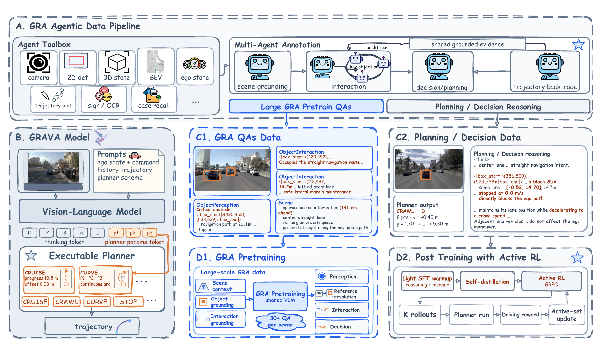
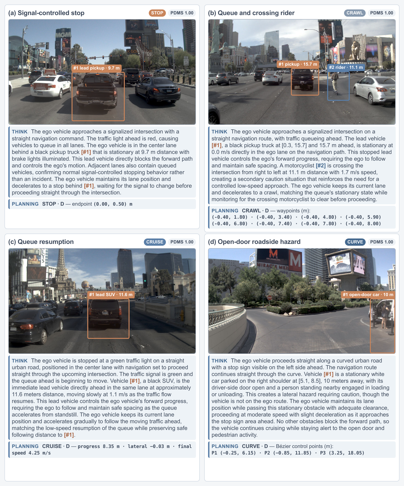
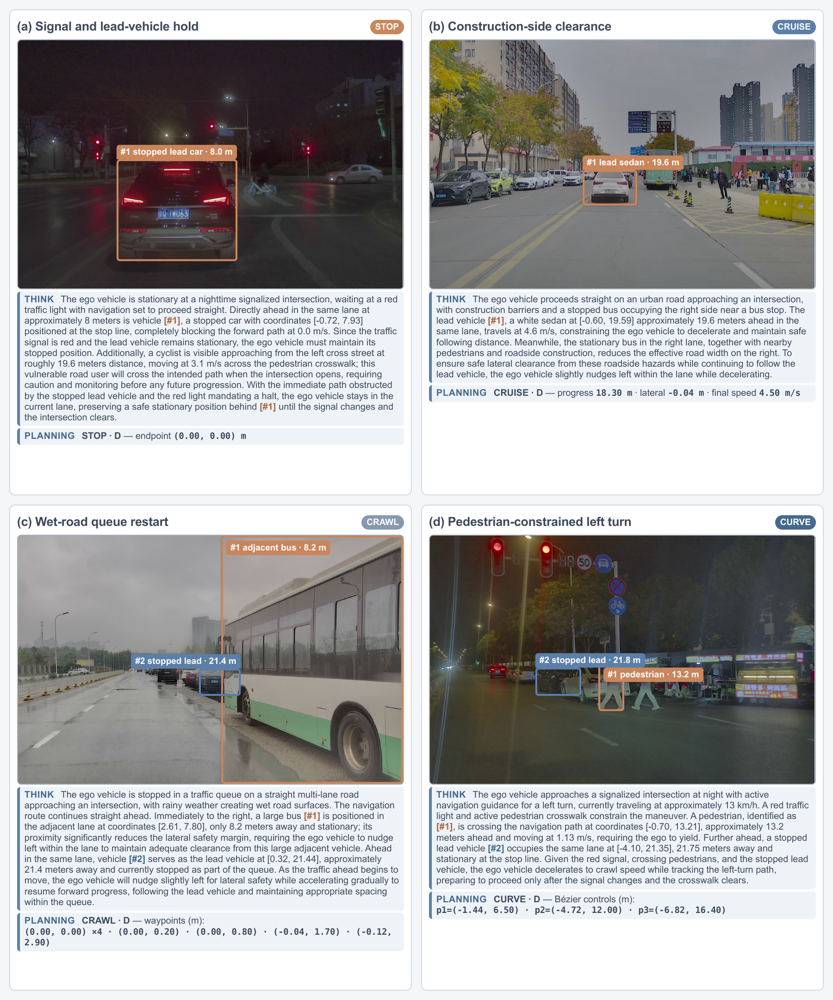

<div align="center">
  
  <h1>GRAVA</h1>
  <h2>Grounded Reasoning-to-Action Representation and Learning<br>for Autonomous Driving</h2>
  <h3>
    Xiao Liu<sup>1,3</sup> ·
    Haoyu Li<sup>1,2</sup> ·
    Jianghao Leng<sup>1,3</sup> ·
    Lin Wang<sup>2</sup> ·
    Chao Sun<sup>1,3,*</sup>
  </h3>
  <p>
    <sup>1</sup> Beijing Institute of Technology &nbsp;&nbsp; <sup>2</sup> Nanyang Technological University
    <br>
    <sup>3</sup> Shenzhen Jiguangzhijie Technology Co., Ltd. &nbsp;&nbsp; <sup>*</sup> Corresponding author
  </p>
  <a href="https://arxiv.org/abs/2609.15169"></a>
  
  
  <a href="https://github.com/AhernResearch/gr-navsim"></a>
  <p>
    <a href="#overview">Overview</a> ·
    <a href="#highlights">Highlights</a> ·
    <a href="#method">Method</a> ·
    <a href="#navsim-qualitative-examples">NAVSIM Examples</a> ·
    <a href="#internal-long-tail-qualitative-examples">Internal Examples</a> ·
    <a href="#project-ecosystem">Ecosystem</a> ·
    <a href="#release-roadmap">Roadmap</a> ·
    <a href="#citation">Citation</a>
  </p>
</div>

## Overview

GRAVA is a vision-language-action framework that keeps physical scene evidence
connected to reasoning and executable driving behavior. Its **Grounded
Reasoning-to-Action (GRA)** representation binds linguistic references to visual
regions and ego-centric physical states, organizes object interactions and
driving decisions in a trajectory-anchored graph, and serializes the resulting
reasoning together with a compact planner action in one autoregressive stream.

The project covers the full research workflow: grounded data construction,
GR-NavSim, progressive model training, executable trajectory generation, and
NAVSIM evaluation.

## Highlights

- **Grounded reasoning that reaches the action.** Visual references and physical
  quantities remain attached to the interactions and decisions used for planning.
- **One autoregressive reasoning-to-action interface.** A single VLM generates
  grounded reasoning followed by an Executable Planner action, which is decoded
  deterministically into a continuous trajectory.
- **GRA-aligned data and learning.** Forward scene grounding and backward
  trajectory anchoring produce consistent cognition and planning supervision;
  progressive training combines grounded pre-training, planner warm-up, verified
  self-distillation, and Active RL.

## Method

GRAVA constructs a trajectory-anchored **Grounded Reasoning-to-Action (GRA)**
graph through forward scene grounding and backward trajectory anchoring, linking
visual references and physical states to object interactions, driving decisions,
and planner actions. The action-relevant subgraph is serialized as grounded
reasoning and followed in the same autoregressive sequence by an **Executable
Planner** action over STOP, CRAWL, CURVE, or CRUISE, which a fixed geometric
decoder converts into a continuous trajectory. Training combines graph-derived
GRA pre-training, planner warm-up, verified self-distillation, and Active RL on
recoverable scenes using trajectory-level driving rewards.

<div align="center">
  <a href="assets/grava-overview.png">
    
  </a>
  <br>
  <sub><strong>GRAVA framework.</strong> An offline agentic pipeline constructs GRA supervision; a single VLM then learns to generate grounded reasoning followed by an executable planner action.</sub>
</div>

<br>

## NAVSIM qualitative examples

<div align="center">
  <a href="assets/grava-real-cases.png">
    
  </a>
  <br>
  <sub><strong>Grounded reasoning-to-action on real NAVSIM scenes.</strong> The examples cover signal-controlled stopping, a queue with a crossing rider, queue resumption, and an open-door roadside hazard. Click the figure to inspect the reasoning and planner outputs at full resolution.</sub>
</div>

<br>

## Internal long-tail qualitative examples

<div align="center">
  <a href="assets/grava-internal-cases.png">
    
  </a>
  <br>
  <sub><strong>Grounded reasoning-to-action on real internal long-tail scenes.</strong> The examples cover a signal and lead-vehicle hold, construction-side clearance, wet-road queue restart, and a pedestrian-constrained left turn. Click the figure to inspect the reasoning and planner outputs at full resolution.</sub>
</div>

<br>

## Project ecosystem

| Repository | Purpose | Status |
| --- | --- | --- |
| **[grava](https://github.com/AhernResearch/grava)** | Project overview and release hub | Available |
| [grava-agent](https://github.com/AhernResearch/grava-agent) | Offline GRA annotation and data construction | Preparing release |
| [gr-navsim](https://github.com/AhernResearch/gr-navsim) | Dataset documentation and release assets | Preparing release |
| [grava-train](https://github.com/AhernResearch/grava-train) | Multi-stage training and evaluation | Preparing release |
| [grava-common](https://github.com/AhernResearch/grava-common) | Shared data contracts and geometry utilities | Under review |
| [grava-sim-engine](https://github.com/AhernResearch/grava-sim-engine) | NAVSIM trajectory scoring integration | Under review |

## Release roadmap

- [x] Project homepage and repository map
- [x] Paper preprint and BibTeX
- [ ] GR-NavSim data card, versions, and download instructions
- [ ] Annotation and data-construction code
- [ ] Training and evaluation code
- [ ] Model checkpoints and end-to-end reproduction guide

We are releasing the project in stages so that every public artifact has a clear
version, documented inputs and outputs, and a reproducible validation path.

## Citation

```bibtex
@misc{liu2026grava,
  title         = {GRAVA: Grounded Reasoning-to-Action Representation and Learning for Autonomous Driving},
  author        = {Xiao Liu and Haoyu Li and Jianghao Leng and Lin Wang and Chao Sun},
  year          = {2026},
  eprint        = {2609.15169},
  archivePrefix = {arXiv},
  primaryClass  = {cs.CV},
  url           = {https://arxiv.org/abs/2609.15169}
}
```

## Acknowledgements

GRAVA builds on the NAVSIM evaluation ecosystem and the Qwen3-VL model family.
We thank the open-source research community for making these foundations
available.
